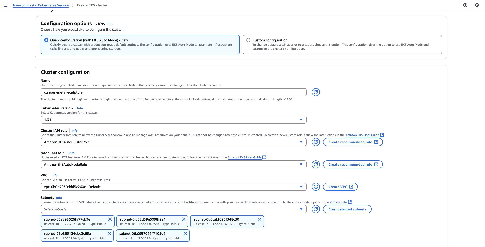
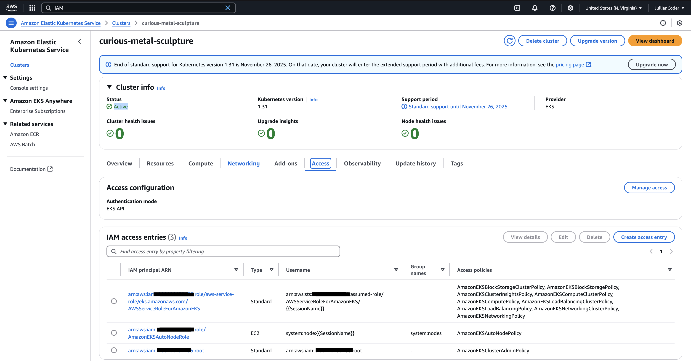

# Creating K8s Infrastructure For Coder

By default, Coder will automtically create the resources you need with it's [Helm chart](https://artifacthub.io/packages/helm/coder-v2/coder). However, to deploy Coder on K8s this generally requires existing Kubernetes infrastructure to support it which can vary between providers.

If you need guidance on setting them up, then follow this document to see different ways of setting up K8s infrastructure with [Minikube](#minikube), [AWS](#aws-elastic-kubernetes-service-setup), [GCP](#google-kubernetes-engine), [Azure](#azure-kubernetes-service), and [Rancher](#ranchers-kubernetes-service).

# Minikube

### Tutorial Cost

Free

---

# AWS Elastic Kubernetes Service

### Tutorial Cost

Free??

### Step 1. Create your Account

Go to [AWS](https://aws.amazon.com/resources/create-account/) and create your cloud account. Alternaively, click this [link](https://signin.aws.amazon.com/signup?request_type=register) to get started.

### Step 2. Create your Cluster

Navigate to the [`"Elastic Kubernetes Service"`](https://us-east-1.console.aws.amazon.com/eks/welcome?region=us-east-1) (EKS) dashboard.

- NOTE: If you opened the link, change your deployment region back to the original if it differs from what you were just in.

Once you're on the EKS home page, select ["Create Cluster"](https://us-east-1.console.aws.amazon.com/eks/cluster-create?region=us-east-1).

**(Optional)** There will be two empty options on the create page: "Cluster IAM role" and "Node IAM role". If you don't have any roles, select "Create Recommended Role" and follow it's creation steps. Afterwards, the menu will have similar options to the image below:



If your options look accurate, select "Create" to start provisioning the cluster.

The cluster will now be in a `Creating...` state. This may take several minutes to complete.

### Step 3. Download your tools.

Before moving on, connect your desktop to the cluster and manage it. To do this, you'll need the following tools:

- [AWS Command Line Tool](https://docs.aws.amazon.com/cli/latest/userguide/getting-started-install.html#getting-started-install-instructions)
- [Kubernetes Command Line Tool](https://k8s-docs.netlify.app/en/docs/tasks/tools/install-kubectl/)
- [Helm](https://helm.sh/docs/intro/install/)

Make sure to download any you're missing (for Windows, MacOS, Linux, etc). Otherwise, visit their home page to install them onto your system.

### Step 4. Get AWS IAM Credentials

Before interacting with your cluster, you need credentials. To do this, create a valid IAM user or principal first.

To create a user, navigate to the [`"Identity Access Management"`](https://us-east-1.console.aws.amazon.com/iam/home?region=us-east-1) (IAM) dashboard.

Look for the "Users" tab and select it. Once open, look for the "Create user" button and do the following: 

1. Set your username (e.g. MyCustomUser) and click "Next".
2. Select "Attach policies directly" and search for "AdministratorAccess". Select this, then click "Next".
3. Finally, select "Create user".

The user is created now. Next, we create it's credentials.

4. Select your user.
5. Select "Security credentials".
6. Select "Create access key".
7. Select "Command Line Interface" and select the confirmation below: "I understand the above recommendation and want to proceed to create an access key". Click "Next"
8. Select "Create access key".
9. Copy the "Access key" and "Secret access key" that appears and save it somewhere safe or download your secrets.
10. Select "Done"

Save the credential details on your clipboard, in a file, or download it. If you mess up anywhere, delete the access key by selecting "Actions > Deactive > Delete" and can recreate it by following the same steps.

### Step 5. Use AWS IAM Credentials Locally.

To use your credentials, run the following command:

```bash
$ aws configure
```

This command will ask you to pass in the following details:

1. AWS Access Key ID
2. AWS Secret Access Key
3. Default Region Name
4. Default Output Format

```bash
AWS Access Key ID [****************HAUO]: ********
AWS Secret Access Key [****************6VyR]: ********
Default region name [us-west-2]: us-east-1
Default output format [json]: 
```

For the `Access Key ID` and `Secret Access Key`, pass in the details you saved. For the region, set it to the region you deployed your cluster in. Finally, leave the output format as `json` or set it.

Verify your credentials by running:

```bash
$ aws sts get-caller-identity
```

The output should look like:

```bash
{
    "UserId": "AIDA6B4DO*******",
    "Account": "9661******",
    "Arn": "arn:aws:iam::9661******:user/MyCustomUser"
}
```

### Step 6. Create the Cluster Access Entry

Once the cluster is in an `Active` state, ensure that the cluster lets your IAM principal access it. To do this, go to the EKS dashboard, select "Clusters", and select the cluster you've created.

Once opened, select "Access" and you should see a list of access entries already populating the window underneath "IAM Access Entries"



If you don't see your IAM principal, then we need to create an entry for it. The "IAM Principal ARN" will have the following format:

```
arn:aws:iam::<YourAccountID>:<IAMPrincipal>...
```

Where "IAMPrincipal" can be "User", "Role", "Root", and more. For more examples of what an IAM Principal ARN looks like, visit this page about [ARN formats](https://docs.aws.amazon.com/IAM/latest/UserGuide/reference-arns.html).

If you've been following this guide and created a user, then it should look like:

```
arn:aws:iam::<YourAccountID>:user/YourUsersName...
```

To create an EKS Access Entry, select "Create access entry". 

For the IAM principal ARN, select your IAM user or principal, and keep type set to "Standard".

Under access policies, search up `AmazonEKSClusterAdminPolicy`, select it, and keep `Access Scope` set to `Cluster`. Once you're finished, select `Add Policy` and click "Next".

To finalize creating the access entry, select "Create". You should be redirected to a page that shows "IAM access entry info", showing the access entry you created for your IAM principal and the AmazonEKSClusterAdminPolicy you tied to it.

### Step 7. Connecting to the Cluster

After getting the access entry, we can start generating a local file defining how to connect. To do this, run the following command to automatically create this local Kubernetes configuration file called `kubeconfig`:

```bash
$ aws eks update-kubeconfig --name <ClusterName>
```

This should return the following ["context"](https://medium.com/@ravipatel.it/understanding-kubernetes-contexts-and-kubeconfig-file-5c3d346c629e):

```bash
Added new context arn:aws:eks:us-east-1:9661******:cluster/<ClusterName> to /Users/<MyUser>/.kube/config
```

To make sure that we're using this context, we need to run:

```bash
$ kubectl config use-context "arn:aws:eks:us-east-1:9661******:cluster/<ClusterName>"
```

And you can verify that your local client is using it by running the following K8s CLI command:

```bash
$ kubectl config current-context
```

Which should return a similar output you're seeing:

```bash
arn:aws:eks:us-east-1:9661******:cluster/<ClusterName>
```

To test if you can properly connect to the cluster, run:

```bash
$ kubectl get svc
```

This should also return something similar to the following output:

```bash
NAME         TYPE        CLUSTER-IP   EXTERNAL-IP   PORT(S)   AGE
kubernetes   ClusterIP   10.100.0.1   <none>        443/TCP   6h17m
```

As a recap of all the commands ran so far, we executed:

```bash
$ aws configure
$ aws sts get-caller-identity
$ aws eks update-kubeconfig --name <ClusterName>
$ kubectl config use-context "arn:aws:eks:us-east-1:9661******:cluster/<ClusterName>"
$ kubectl config current-context
$ kubectl get svc
```

### Step 8. Create a Default Storage Class

You should now be able to connect to your cluster and run any K8s APIs against it. 

Before we can start deploying Coder though, we'll need a [`StorageClass`](https://kubernetes.io/docs/concepts/storage/storage-classes/).

This allows any [`Pods`](https://kubernetes.io/docs/concepts/workloads/pods/) to mount a [`Volume`](https://kubernetes.io/docs/concepts/storage/volumes/). Volumes are created from a [`PersistentVolumeClaim`](https://kubernetes.io/docs/concepts/storage/persistent-volumes/) which handles requesting them from your cloud provider.

To configure a default storage class, create a `storageclass.yaml` file and embed the following content:

```yaml
apiVersion: storage.k8s.io/v1
kind: StorageClass
metadata:
  name: gp3
  annotations:
    storageclass.kubernetes.io/is-default-class: "true"
provisioner: ebs.csi.eks.amazonaws.com
volumeBindingMode: WaitForFirstConsumer
parameters:
  type: gp3
  encrypted: "true"
```

Afterwards, run the following command to create the StorageClass inside your cluster:

```bash
$ kubectl apply -f storageclass.yaml
```

You can confirm that storage class was successfully created by running:

```bash
$ kubectl get storageclass
```

By default, EKS does not create a default StorageClass for you. You may notice that there's a `gp2` storage class inside your EKS Cluster alongside the one we created, `gp3`:

```bash
NAME                    PROVISIONER                 RECLAIMPOLICY   VOLUMEBINDINGMODE      ALLOWVOLUMEEXPANSION   AGE
gp3 (default)           ebs.csi.eks.amazonaws.com   Delete          WaitForFirstConsumer   false                  10m
gp2                     kubernetes.io/aws-ebs       Delete          WaitForFirstConsumer   false                  20h
```

# Troubleshooting

### Unable to create an AWS Account

Make sure that your email is not already in-use. You should receive a confirmation email in your inbox with a confirmation code. Otherwise, be sure to review the related resources or [contact AWS support](https://aws.amazon.com/contact-us/) for assistance.

- [Creating a standalone AWS account](https://docs.aws.amazon.com/accounts/latest/reference/manage-acct-creating.html)
- [How can I reactive my suspended AWS account?](https://repost.aws/knowledge-center/reactivate-suspended-account)
- [Can I reopen my closed AWS account?](https://repost.aws/knowledge-center/reopen-aws-account)
- [Reset a lost or forgotten user root password](https://docs.aws.amazon.com/IAM/latest/UserGuide/reset-root-password.html)

### Unable to Create Cluster

If you're on a brand new AWS Account, the process can take up to 10 minutes or more. You may also receive an email like the following for creating a cluster for the first time:

```
Dear AWS Customer,

You recently requested an AWS service that required additional validation. Your request has now been validated for AWS US East (N. Virginia) Region(s). If you're still experiencing difficulty, then contact us through the Support Center ...

Sincerely,
Amazon Web Services
This message was produced and distributed by Amazon Web Services, Inc. and affiliates, 410 Terry Ave. North, Seattle, WA 98109-5210.
```

If you're not on a brand new AWS account, make sure to review AWS's ["Create a Cluster"](https://docs.aws.amazon.com/eks/latest/userguide/create-cluster.html#_prerequisites) guide for prerequisites. For this walkthrough, you should at least have:

- An existing VPC and subnets that [meet Amazon EKS requirements](https://docs.aws.amazon.com/eks/latest/userguide/creating-a-vpc.html).
- The kubectl command line tool is installed on your device The version can be the same as or up to one minor version earlier or later than the Kubernetes version of your cluster.
- Version 2.12.3 or later or version 1.27.160 or later of the AWS Command Line Interface (AWS CLI) installed and configured on your device. To check your current version, use `aws --version | cut -d / -f2 | cut -d ' ' -f1`. Package managers such `yum`, `apt-get`, or `brew` for macOS are often several versions behind the latest version of the AWS CLI. To install the latest version, see Installing and Quick configuration with aws configure in the AWS Command Line Interface User Guide.
- An IAM principal with permissions to create and describe an Amazon EKS cluster, and a principal with permissions to create and modify an IAM Role and it's permissions. These permissions may include:

    - [eks:CreateCluster](https://docs.aws.amazon.com/eks/latest/APIReference/API_CreateCluster.html)
    - [eks:DescribeCluster](https://docs.aws.amazon.com/eks/latest/APIReference/API_DescribeCluster.html)
    - [eks:ListClusters](https://docs.aws.amazon.com/eks/latest/APIReference/API_ListClusters.html)
    - [eks:UpdateClusterConfig](https://docs.aws.amazon.com/eks/latest/APIReference/API_UpdateClusterConfig.html)
    - [eks:UpdateClusterVersion](https://docs.aws.amazon.com/eks/latest/APIReference/API_UpdateClusterVersion.html)

You can also follow EKS's ["Create Cluster - AWS Console"](https://docs.aws.amazon.com/eks/latest/userguide/create-cluster.html#_step_2_create_cluster) guide to get a cluster ready. 

### Unable to Download Tools

The requirements for each tool will differ between systems. Make sure to visit their respective troubleshooting pages:

- [Troubleshooting Errors for the AWS CLI](https://docs.aws.amazon.com/cli/latest/userguide/cli-chap-troubleshooting.html)
- [Unable to install Kubectl on Linux](https://kubernetes.io/docs/tasks/tools/install-kubectl-linux/#no-auth-provider-found)
- [Unable to install Kubectl on Windows](https://kubernetes.io/docs/tasks/tools/install-kubectl-windows/#no-auth-provider-found)
- [Unable to install Kubectl on MacOs](https://kubernetes.io/docs/tasks/tools/install-kubectl-macos/#no-auth-provider-found)
- [Issues with Helm](https://helm.sh/docs/faq/troubleshooting/)

If you're unable to resolve your issue still, be sure to file a ticket to the respective services.

- [AWS Support](https://aws.amazon.com/contact-us/)
- [kubernetes/kubectl](https://github.com/kubernetes/kubectl/issues)
- [helm/helm](https://github.com/helm/helm/issues)

### Unable to Get IAM Credentials

Make sure you have access to the AWS account the [required permissions](https://docs.aws.amazon.com/IAM/latest/UserGuide/access_permissions-required.html) to create IAM Users and associate/create policies. You can follow this AWS guide for ["Creating an IAM User in your AWS Account"](https://docs.aws.amazon.com/IAM/latest/UserGuide/id_users_create.html) for more details.

If you're still having issues with creating the user, check if you have the following minimum permissions:

- [iam:CreateUser](https://docs.aws.amazon.com/IAM/latest/APIReference/API_CreateUser.html)
- [iam:DeleteUser](https://docs.aws.amazon.com/IAM/latest/APIReference/API_DeleteUser.html)
- [iam:UpdateUser](https://docs.aws.amazon.com/IAM/latest/APIReference/API_UpdateUser.html)
- [iam:GetUser](https://docs.aws.amazon.com/IAM/latest/APIReference/API_GetUser.html)
- [iam:ListUsers](https://docs.aws.amazon.com/IAM/latest/APIReference/API_ListUsers.html)
- [iam:AttachUserPolicy](https://docs.aws.amazon.com/IAM/latest/APIReference/API_AttachUserPolicy.html)
- [iam:DetachUserPolicy](https://docs.aws.amazon.com/IAM/latest/APIReference/API_DetachUserPolicy.html)

Otherwise, please visit the AWS troubleshooting documentation on this

- [Troubleshoot IAM](https://docs.aws.amazon.com/IAM/latest/UserGuide/troubleshoot_access-denied.html)
- [Troubleshoot Access Denied Error Messages](https://docs.aws.amazon.com/IAM/latest/UserGuide/troubleshoot_access-denied.html)

If you're having problems with the AWS access keys, then make sure that:

- You have the [correct permissions](https://docs.aws.amazon.com/IAM/latest/UserGuide/access-keys_required-permissions.html) to create and manage them.
    - [iam:CreateAccessKey](https://docs.aws.amazon.com/IAM/latest/APIReference/API_CreateAccessKey.html)
    - [iam:DeleteAccessKey](https://docs.aws.amazon.com/IAM/latest/APIReference/API_DeleteAccessKey.html)
    - [iam:UpdateAccessKey](https://docs.aws.amazon.com/IAM/latest/APIReference/API_UpdateAccessKey.html)
    - [iam:ListAccessKeys](https://docs.aws.amazon.com/IAM/latest/APIReference/API_ListAccessKeys.html)
    - [iam:GetAccessKeyLastUsed](https://docs.aws.amazon.com/IAM/latest/APIReference/API_GetAccessKeyLastUsed.html)

- If you're using existing credentials, then make sure that they [weren't deleted or deactivated](https://docs.aws.amazon.com/IAM/latest/UserGuide/access-key-self-managed.html).
- Make sure you have [permissions to run EKS actions](https://docs.aws.amazon.com/eks/latest/userguide/create-cluster.html#_prerequisites) on the Cluster.

If you're still having access key issues, then be sure to check the AWS documentation on this:

- [I Lost My Access Keys](https://docs.aws.amazon.com/IAM/latest/UserGuide/troubleshoot.html#troubleshoot_general_access-keys)

### Unable to Create an Access Entry

To add access entries, the principal you're logged in as needs sufficient IAM permissions. Make sure you can run:

- [eks:CreateAccessEntry](https://docs.aws.amazon.com/eks/latest/APIReference/API_CreateAccessEntry.html)
- [eks:DeleteAccessEntry](https://docs.aws.amazon.com/eks/latest/APIReference/API_DeleteAccessEntry.html)
- [eks:DescribeAccessEntry](https://docs.aws.amazon.com/eks/latest/APIReference/API_DescribeAccessEntry.html)
- [eks:UpdateAccessEntry](https://docs.aws.amazon.com/eks/latest/APIReference/API_UpdateAccessEntry.html)
- [eks:ListAccessEntries](https://docs.aws.amazon.com/eks/latest/APIReference/API_ListAccessEntries.html)
- [eks:AssociateAccessPolicy](https://docs.aws.amazon.com/eks/latest/APIReference/API_AssociateAccessPolicy.html)
- [eks:ListAccessPolicies](https://docs.aws.amazon.com/eks/latest/APIReference/API_ListAccessPolicies.html)
- [eks:ListAssociatedAccessPolicies](https://docs.aws.amazon.com/eks/latest/APIReference/API_ListAssociatedAccessPolicies.html)
- [eks:DisassociateAccessPolicy](https://docs.aws.amazon.com/eks/latest/APIReference/API_DisassociateAccessPolicy.html)

If you have the correct permissions but are still having trouble creating an access entry, make sure to review the following AWS documents:

- [Grant IAM Users Access to K8s with Access Entries](https://docs.aws.amazon.com/eks/latest/userguide/access-entries.html)
- [AmazonEKSClusterAdminPolicy](https://docs.aws.amazon.com/eks/latest/userguide/access-policy-permissions.html#access-policy-permissions-amazoneksclusteradminpolicy)

### Unable to Connect to Cluster

If you're having any authorization issues and you're using the AWS CLI to automatically create your kubeconfig file, then make sure you have the `eks:DescribeCluster` IAM permission. Check out the following AWS documentation if you need more details

- [Access cluster with kubectl](https://docs.aws.amazon.com/eks/latest/userguide/create-kubeconfig.html)
- [Unauthorized Access or Access Denied](https://docs.aws.amazon.com/eks/latest/userguide/troubleshooting.html)
- [Hostname Doesn't Match](https://docs.aws.amazon.com/eks/latest/userguide/troubleshooting.html#python-version)

### Unable to Create a Storage Class

All clusters created from the EKS Console (v1.31+) have "EKS Auto-Mode" enabled. This infers clusters use the [`CSIDriver`](https://kubernetes-csi.github.io/docs/csi-driver-object.html): `ebs.csi.eks.amazonaws.com`. 

To see how the `ebs.csi.eks.amazonaws.com` provisioner is used, reference ["Creating a Storage Class"](https://docs.aws.amazon.com/eks/latest/userguide/create-storage-class.html) example on the AWS documentation. 

---

# Google Kubernetes Engine

### Tutorial Cost

Free??

# Azure Kubernetes Service

### Tutorial Cost

Free??

# Ranchers Kubernetes Service